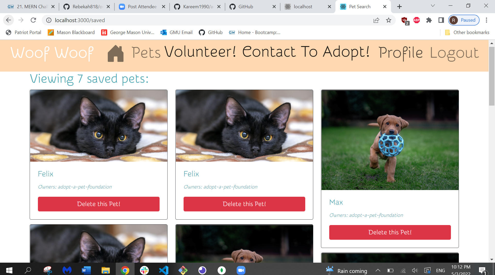
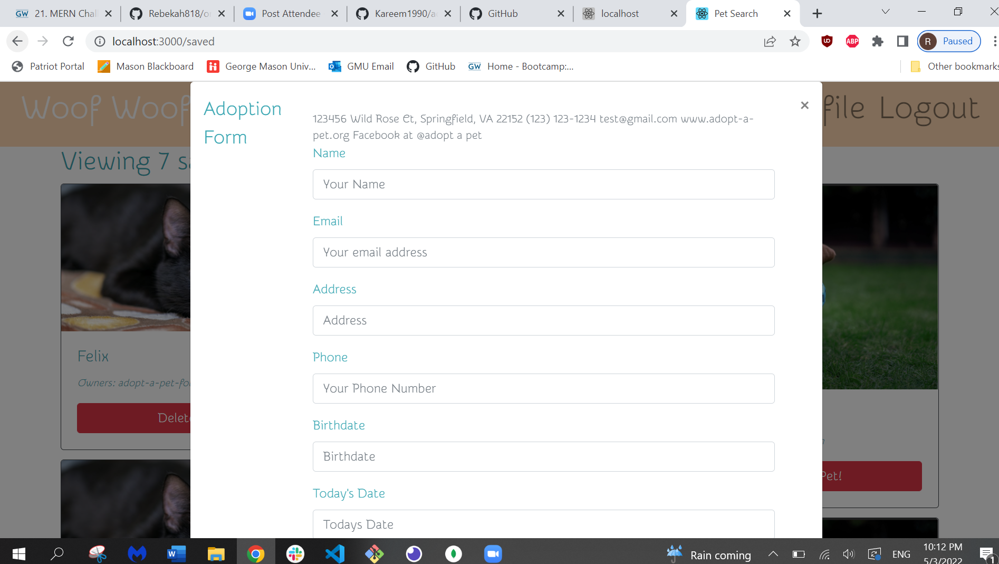
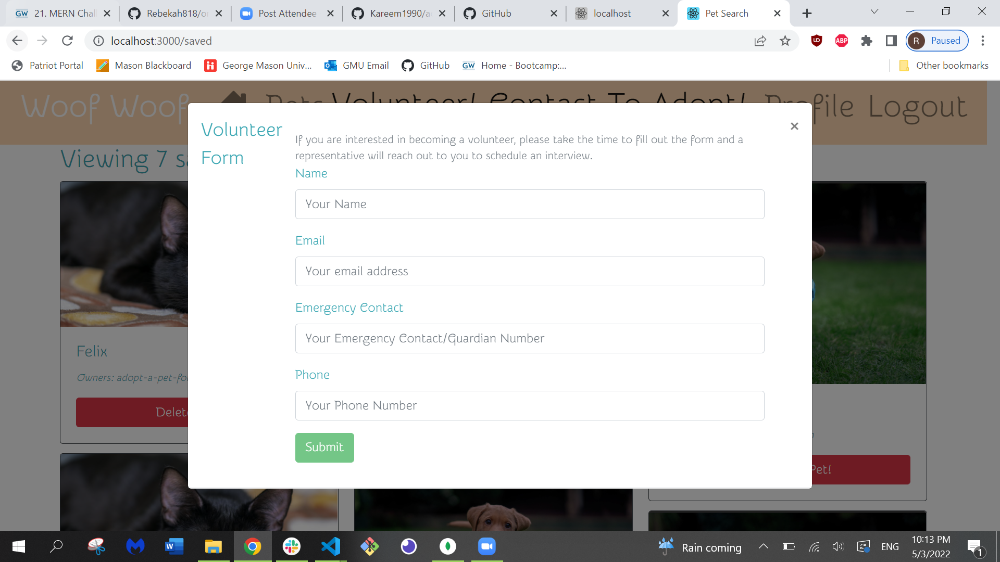

# Adopt-a-Pet

# Description
Adopt-a-pet foundation is a local pet rescue and adoption agency. Families in search of a furrever friend can see pets available for adoption and save them to their pet profile. Families can even apply online by filling out the adoption form. If you love animals and want to help out the foundation is always looking for volunteers.Just fill out the online volunteer form! 
# Installation
npm install: node, express, apollo-server-express, mongoose, express, cors, dotenv. You will also need to set up a mongo database.
# Usage
This project is used to connect families with pets who need homes.
# Contributors 
Rebekah818
  
Kareem1990
  
kvTsira
 
Sohrob1
# links
GitHub Link:

https://github.com/Kareem1990/adopt-a-pet

Heroku LInk:

https://lit-thicket-52493.herokuapp.com/

# Screenshots

